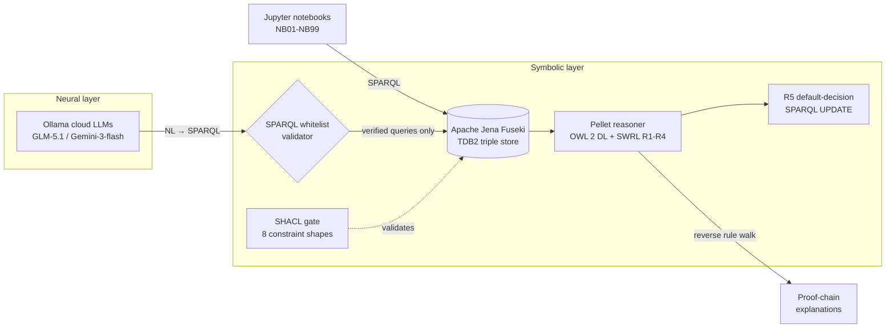

# Neurosymbolic Credit-Risk Knowledge Graph

An end-to-end neurosymbolic reasoning system for credit-risk decisioning. It pairs a formal symbolic stack — an OWL 2 DL ontology, Pellet inference, SHACL validation, and SWRL rules over an Apache Jena Fuseki triple store — with a neural layer where Ollama-cloud LLMs translate natural language into SPARQL. Every LLM-proposed query passes through a symbolic whitelist gate before it is allowed to execute, and every credit decision is traceable to a rule-level proof chain reconstructed from the materialized graph.


## Why this exists

Large language models hallucinate. In a regulated domain like consumer credit decisioning, a confidently wrong answer is not a UX bug — it is a compliance and fairness liability, and "the model said so" is not a defensible justification. What such domains need are verifiable guarantees: every decision must rest on auditable logic, and every claim must be checkable against ground truth. This project demonstrates the *LLM-proposes / symbolic-layer-verifies* pattern concretely: the neural layer is fast and flexible but never trusted, the symbolic layer is the source of truth, and explanations are first-class artifacts rather than after-the-fact rationalizations.

## Architecture



A full walkthrough of each component and the data flow between them lives in [docs/architecture.md](docs/architecture.md).

## Results

The dataset models 20 applicants (plus co-applicants) and 30 loan applications — 10 Mortgage, 10 Auto, 10 Personal — carrying 52 risk signals. Together with the ontology schema this is roughly ~925 RDF triples (T-Box + A-Box). Each reasoning stage below runs against that data; the figures come from the committed, executed notebooks.

| Stage | Tool | Outcome |
|---|---|---|
| Applicant classification | Pellet (OWL 2 DL) | 8 Prime / 8 NearPrime / 6 Subprime (22 classified; the Prime and NearPrime counts each include co-applicants) |
| Same data, RL profile | Jena (OWL RL) | 0 applicants classified — the profile gap is NB02's centerpiece |
| Application risk tiering | SWRL R1–R4 | 12 LowRisk / 8 HighRisk applications |
| Initial decisions | SWRL R1–R4 | 4 Approve / 8 Decline |
| Default-decision backfill | R5 (SPARQL UPDATE) | 18 Review — 4 + 8 + 18 = 30 total |
| Constraint validation | SHACL (8 shapes) | Clean data conforms; all 7 deliberately-broken fixtures caught (NB03) |
| Symbolic pipeline | reset → load → reason → validate → query | ~2.4 s on Apple Silicon M4 |
| Full neurosymbolic run | + live LLM synthesis of 3 explanations | ~15 s total |
| LLM grounding check | 0–2 judge rubric | live run scored 2/2 |

## Design highlights

These are the decisions worth discussing; each links into [docs/architecture.md](docs/architecture.md) for the full reasoning.

**OWL 2 DL datatype facets, deliberately outside the RL profile.** The `:PrimeApplicant`-style tier classes are defined as equivalent classes using datatype facets (`xsd:withRestrictions`), which places them in OWL 2 DL rather than the lighter RL profile. This is not an accident: NB02 runs the identical A-Box through both reasoners side by side. Jena RL classifies 0 applicants; Pellet DL classifies 22. The contrast makes the abstract "choose your profile" advice tangible — profile choice changes what your system can actually conclude.

**Punned tier classes so SWRL can reference them as individuals.** The risk-tier classes (e.g. `:LowRiskApplication`) are *punned* — used as both a class and an individual — so a SWRL rule can write `hasRiskTier(?app, :LowRiskApplication)` and reference the tier by name. Punning is the clean OWL 2 mechanism for this dual use rather than a hack around the type system.

**R5 as a SPARQL UPDATE because SWRL lacks negation-as-failure.** Rules R1–R4 are pure SWRL and materialize through Pellet. The "if no decision was reached, default to Review" rule cannot be: SWRL has no negation-as-failure, so it cannot test for the *absence* of a triple. NB04 hits this wall head-on, then implements R5 as a SPARQL UPDATE — the standard, honest way to express closed-world defaults on an otherwise open-world graph.

**LLM output is never trusted.** Natural-language questions become SPARQL via an LLM, but the query is first parsed and then run through a predicate whitelist validator that rejects any hallucinated or out-of-schema predicate before it can touch the store. Decision explanations are likewise not taken from the model: proof chains are reconstructed by a reverse rule walk over the materialized graph. (Note: this is an explicit reverse walk over the rule structure, *not* a call to Pellet's `explain_inference` API — using that API is future work, and we keep the claim precise.)

## Notebook guide

Notebooks are committed **with their executed outputs**, so every result below is readable directly on GitHub with no setup required.

| Notebook | Topic | What its committed outputs show |
|---|---|---|
| [01_sparql_basics](notebooks/01_sparql_basics.ipynb) | SPARQL basics | SELECT/ASK/CONSTRUCT/OPTIONAL/UNION, aggregates, property paths, and UPDATE running live against the loaded graph |
| [02_owl_inference](notebooks/02_owl_inference.ipynb) | OWL inference, RL vs DL | The same A-Box reasoned by Jena RL (0 classified) and Pellet DL (22 classified) side by side |
| [03_shacl_validation](notebooks/03_shacl_validation.ipynb) | SHACL validation | 8 constraint shapes; clean data conforms, and 7 deliberately-broken fixtures each produce a validation report pinpointing the offending node |
| [04_swrl_credit_rules](notebooks/04_swrl_credit_rules.ipynb) | SWRL credit rules | R1–R4 materializing risk tiers and decisions, the R2a/R2b disjunction idiom, and the R5 negation-as-failure wall resolved with SPARQL UPDATE |
| [05_neurosymbolic_loop](notebooks/05_neurosymbolic_loop.ipynb) | Neurosymbolic loop (live LLM) | NL→SPARQL generation gated by the whitelist validator, 3 concurrent requests under the Semaphore(3) ceiling, proof-chain extraction, and a 2/2 grounding-judge score |
| [99_full_pipeline](notebooks/99_full_pipeline.ipynb) | Full pipeline | The complete reset → load → reason → validate → query → explain run with per-step performance profiling |

## Quickstart

The fastest path is the setup script, which installs the Homebrew dependencies (colima, docker, openjdk, uv, ollama), starts Colima, pulls the Fuseki container, creates the `.venv` and installs dependencies, registers the `credit-risk-kg` Jupyter kernel, loads the ontology, and runs the Phase A verification — about 1–2 minutes:

```bash
./scripts/setup.sh          # interactive: asks before each install step
./scripts/setup.sh --yes    # fully automatic: assume yes
./scripts/setup.sh --check  # inspect state only, change nothing
```

<details>
<summary>Manual setup (to see what each step does)</summary>

```bash
# 1. Dependencies
brew install colima docker docker-compose openjdk ollama uv

# 2. Start Fuseki
mkdir -p fuseki_data/credit-risk        # TDB2 location must exist first
cp .env.example .env
colima start --cpu 2 --memory 3 --arch aarch64 --mount /Volumes/<your-drive>:w
docker compose up -d
curl -s http://localhost:3030/\$/ping   # a timestamp means it is up

# 3. Python env + load ontology
uv venv --python 3.11
uv pip install -e ".[dev]"
.venv/bin/python scripts/reset_fuseki.py
for f in credit_risk.ttl instances/customers.ttl instances/applications.ttl; do
    .venv/bin/python scripts/load_ontology.py "ontology/$f"
done

# 4. Register the Jupyter kernel + verify Phase A
.venv/bin/python -m ipykernel install --user --name=credit-risk-kg \
    --display-name="Python 3 (credit-risk-kg)"
.venv/bin/python scripts/verify_phase_a.py
```

</details>

<details>
<summary>Launching Jupyter</summary>

The `PATH` prefix puts Java 25 on the path (Pellet, used in NB02/NB04, needs it) and the project `.venv` Python is used automatically:

```bash
PATH=/opt/homebrew/opt/openjdk/bin:$PATH .venv/bin/jupyter lab
```

To run it in the background so you can close the terminal:

```bash
PATH=/opt/homebrew/opt/openjdk/bin:$PATH \
  nohup .venv/bin/jupyter lab --no-browser > /tmp/jupyter.log 2>&1 &
.venv/bin/jupyter server list   # shows the URL with its token
```

After opening a notebook, select the **`Python 3 (credit-risk-kg)`** kernel (not the default `Python 3`), or you will hit `ModuleNotFoundError` for `rdflib` / `pyshacl` / `owlready2`.

</details>

NB05 makes live LLM calls. To run it you need a local Ollama daemon with cloud access configured (one time):

```bash
brew services start ollama   # run the daemon in the background
ollama signin                # one-time, sets cloud-model credentials
```

All other notebooks run fully offline.

## Repository structure

```
.
├── ontology/                # T-Box + A-Box (Turtle)
├── notebooks/               # teaching notebooks, committed with outputs
├── scripts/                 # CLI tools (load / reset / run_reasoner / verify_phase_*)
│   └── _build_nb*.py        # reproducible generators for the .ipynb files
├── docs/                    # architecture + design notes + cheatsheet + troubleshooting
│   ├── architecture.md
│   ├── ontology_design.md
│   ├── reasoning_cheatsheet.md
│   └── trouble_shooting.md
├── tests/                   # pytest suite (offline)
├── docker-compose.yml       # Fuseki on :3030
├── pyproject.toml           # uv-managed
└── .github/workflows/ci.yml # two-job CI
```

The `_build_nb*.py` scripts are the reproducible source for the notebooks — the committed `.ipynb` files are regenerated from them, so notebook content stays under version control as code.

## Testing & CI

The pytest suite is 14 tests, all offline (no Fuseki, no LLM) and under 1 second:

```bash
.venv/bin/pytest -q
```

CI runs two jobs on GitHub Actions ([.github/workflows/ci.yml](.github/workflows/ci.yml)):

1. **Lint + unit** — `ruff` formatting/lint checks and the offline pytest suite.
2. **Integration smoke** — spins up Fuseki in Docker and runs the Pellet reasoning path end to end.

## License

Licensed under the [Apache License 2.0](LICENSE) — including its patent grant. Copyright 2026 Nikko & Co LLC.
